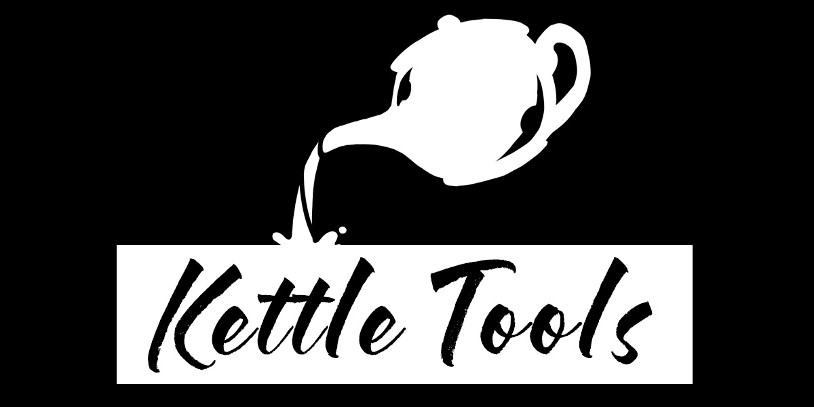

Tools for scene management, version control, and in-editor documentation for team communication.
 
 
Developed for collaboration and communication within Building Virtual Worlds at the Entertainment Technology Center. 

Ideal for small teams with a need for asynchronous communication, or developers creating templates and intermediary content.
