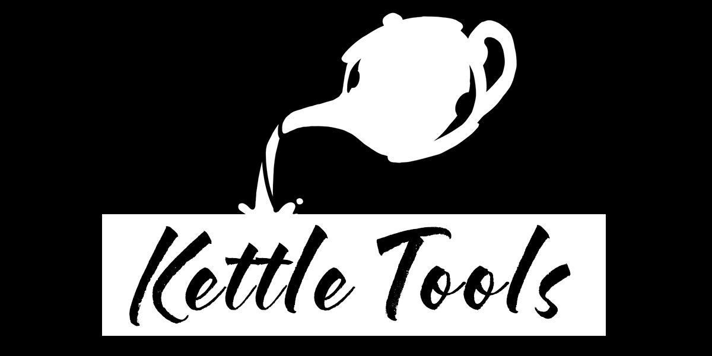

Tools for scene management, version control, and in-editor documentation for team communication.
 
 
Developed for collaboration and communication within Building Virtual Worlds at the Entertainment Technology Center. 

Ideal for small teams with a need for asynchronous communication, or developers creating templates and intermediary content.

Warning: API is still under active development. Please use in-editor "Readme" assets set to "External" mode only to prevent data loss for the time being. Once the readme portion of the API is stable, this will not be neccesary.